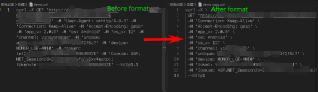

<div align="center">

# CurlFormat

**Professional curl command formatter for Visual Studio Code**

[](https://code.visualstudio.com/)
[](LICENSE)

Transform messy curl commands into clean, readable, multi-line format with ease.

</div>

---

## ✨ Features

- 🎯 **One-Click Formatting** - Format entire `.curl` files instantly
- 🔍 **Smart Selection** - Format selected ranges of curl commands
- 🛠️ **Comprehensive Support** - Handles all standard curl flags and options
- 📏 **Auto Line Breaking** - Intelligent multi-line formatting with backslash continuation
- ✨ **Clean Output** - Transforms complex one-liners into readable, structured commands

## 📸 Preview



## 🚀 Usage

### Formatting Your Curl Commands

1. Open or create a `.curl` file in VS Code
2. Press `Shift + Alt + F` (Windows/Linux) or `Shift + Option + F` (Mac) to format the entire document
3. Or select a range of text and use the format command to format only the selection

### Example

**Before:**
```bash
curl 'https://api.example.com/users' -H 'Authorization: Bearer token123' -H 'Content-Type: application/json' -d '{"name":"John","age":30}'
```

**After:**
```bash
curl 'https://api.example.com/users' \
 -H 'Authorization: Bearer token123' \
 -H 'Content-Type: application/json' \
 -d '{"name":"John","age":30}'
```

## 📦 Installation

### From VS Code Marketplace

1. Open VS Code
2. Go to Extensions (Ctrl+Shift+X)
3. Search for "CurlFormat"
4. Click Install

### Manual Installation

1. Download the latest `.vsix` file from the [Releases](../../releases) page
2. In VS Code, go to Extensions → ... (three dots) → Install from VSIX...
3. Select the downloaded `.vsix` file

## 🛠️ Development

### Setup

```bash
# Install dependencies
npm install

# Compile in watch mode
npm run watch
```

### Testing

Press `F5` in VS Code to launch a new Extension Development Host window with your extension loaded.

### Building

```bash
# Compile the project
npm run compile

# Package the extension
npm install -g vsce
vsce package
```

## 📄 License

[MIT](LICENSE)

## 🌏 中文说明

### 简介

CurlFormat 是一款专业的 Visual Studio Code 插件，用于格式化 curl 命令。它能将复杂的单行 curl 命令转换为清晰易读的多行格式。

### 主要特性

- 🎯 **一键格式化** - 瞬间格式化整个 `.curl` 文件
- 🔍 **智能选择** - 格式化选中的 curl 命令片段
- 🛠️ **全面支持** - 支持所有标准 curl 标志和选项
- 📏 **自动换行** - 智能的多行格式化，使用反斜杠续行
- ✨ **清晰输出** - 将复杂的单行命令转换为可读的结构化命令

### 使用方法

1. 在 VS Code 中打开或创建 `.curl` 文件
2. 按 `Shift + Alt + F` (Windows/Linux) 或 `Shift + Option + F` (Mac) 格式化整个文档
3. 或者选中部分文本，使用格式化命令仅格式化选中内容

### 示例

**格式化前：**
```bash
curl 'https://api.example.com/users' -H 'Authorization: Bearer token123' -H 'Content-Type: application/json' -d '{"name":"John","age":30}'
```

**格式化后：**
```bash
curl 'https://api.example.com/users' \
 -H 'Authorization: Bearer token123' \
 -H 'Content-Type: application/json' \
 -d '{"name":"John","age":30}'
```

---

<div align="center">

**Made with ❤️ for developers**

</div>
